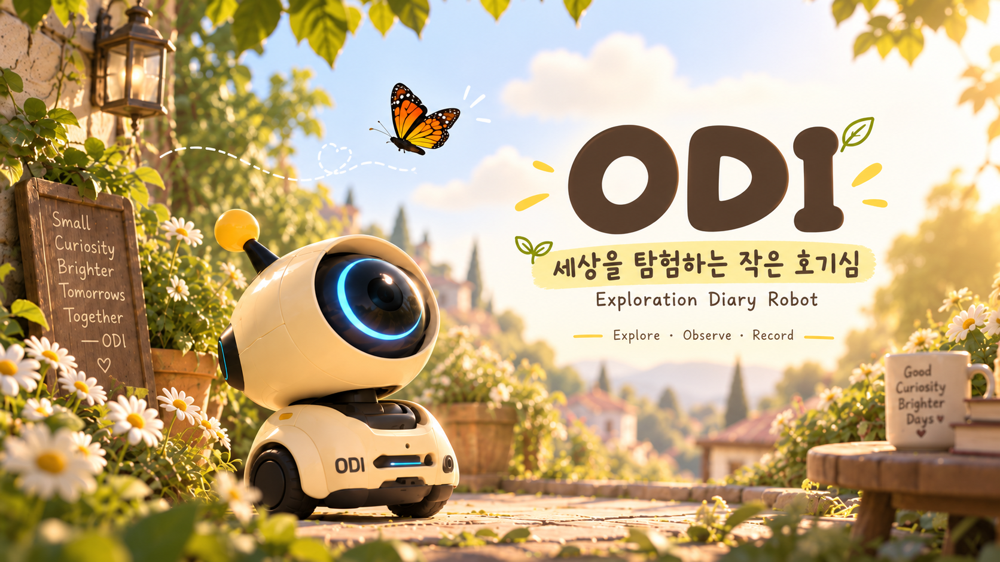
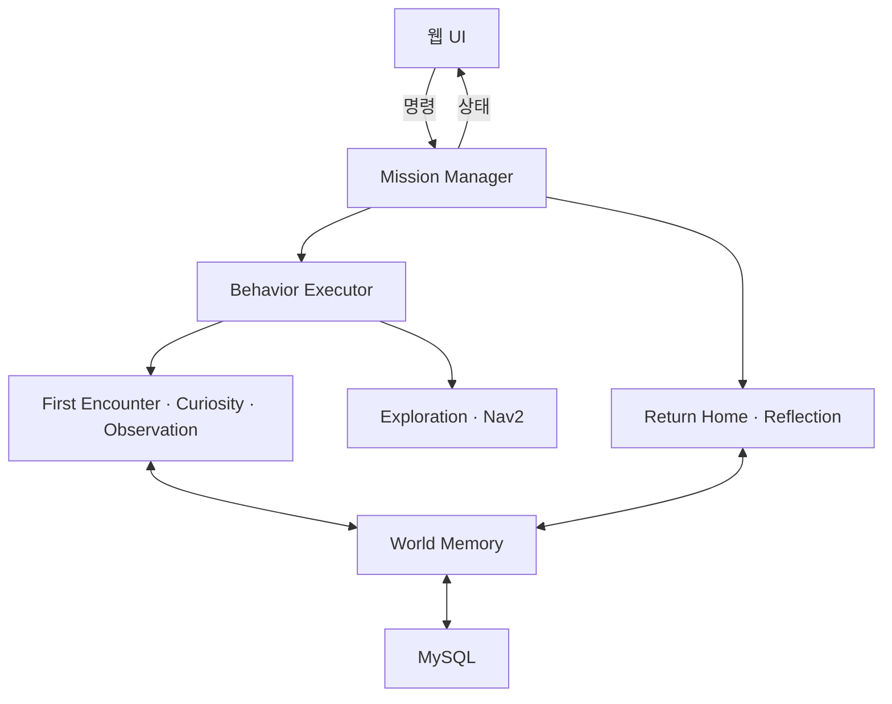

# ODI · 호기심 많은 반려 탐험 로봇

> 스스로 탐험하고, 발견한 경험을 기억해 사진 일기로 남기는 ROS 2 기반 반려 로봇

<p align="center">
  
</p>

**[실제 로봇 시연 영상](https://youtu.be/1bXQdc1NZD0)** · [핵심 코드](#핵심-코드) · [실행 방법](#실행-방법)

## 프로젝트 소개

ODI는 주변을 탐험하다 물체를 발견하면 과거 관찰 기록과 비교해 더 살펴볼지 판단합니다. 관찰이 필요한 대상에 접근해 사진과 특징을 저장하고, 탐험을 마치면 그날의 기록으로 오디 시점의 일기를 작성합니다.

**탐험 → 발견 → 관찰 → 기억 → 이야기**가 이어지는 경험을 구현했습니다. 기능별 ROS 2 노드와 공통 인터페이스를 두어 팀원이 독립적으로 개발하고 통합할 수 있도록 설계했습니다.

| 항목 | 내용 |
| --- | --- |
| 개발 기간 | 2026.07–2026.09 |
| 프로젝트 형태 | 팀 프로젝트 · 실내 탐험 로봇 프로토타입 |
| 하드웨어 | TurtleBot3 Waffle Pi, Raspberry Pi 4, 2D LiDAR, 카메라, Arduino 기반 헤드 |
| 주요 기술 | Ubuntu 22.04, ROS 2 Humble, Python, Nav2, Cartographer, YOLOv8, OpenCV |
| 기록·웹 | MySQL, OpenAI API, Flask, Flask-Sock, HTML/CSS/JavaScript |

## 팀 구성과 담당 역할

| 팀원 이름 | 담당 영역 |
| --- | --- |
| 김동우 | 기획, 소프트웨어 구조 설계, Mission Manager·Behavior Executor, World Memory·Reflection 및 API 기반 기록 처리, 시스템 통합 |
| 김도경 | 하드웨어 구성, Yolo 인지 구현, 관찰 주행 구현, 로봇 테스트 |
| 윤여진 | 웹 기획 및 개발, Curiosity 호기심 판단 노드 |

## 주요 기능

| 단계 | 구현 내용 |
| --- | --- |
| 자율 탐험 | 프론티어를 탐색하고, 유효한 프론티어가 없으면 알려진 공간 안에서 로밍 |
| 발견·호기심 | YOLO 검출 후 첫 만남의 특징을 추출하고, 같은 검출 클래스의 과거 기록과 비교해 새로움·변화 점수로 관찰 여부 결정 |
| 관찰·촬영 | 검출 영역의 방향과 2D LiDAR 거리로 관찰 위치를 계산하고 Nav2로 접근. 여러 프레임의 선명도와 밝기를 고려해 대표 사진 선택 |
| 기억 | 탐험 세션별 관찰 특징·사진 경로·요약을 MySQL에 저장하고 이후 호기심 판단에 재사용 |
| 일기 | 해당 탐험의 성공한 관찰 기록으로 일기를 생성하고 사진·탐험 경로와 함께 웹에 표시 |
| 일반 모드 | 인지·이동·헤드 제어를 조합한 간단한 행동으로 모듈 구조의 확장 가능성 확인 |

## 시스템 구조



주요 책임 관계를 요약한 구성도입니다. 실제 노드 간에는 ROS 2 Topic·Service·Action으로 명령과 결과를 교환합니다.

- **Mission Manager:** 준비·탐험·복귀·회고·완료·초기화·오류를 구분합니다.
- **Behavior Executor:** 탐험 중 첫 만남, 호기심 평가, 관찰을 연결하고 Blackboard에서 대상과 행동 결과를 관리합니다.
- **World Memory:** 저장·조회를 서비스로 제공하고 `session_id`로 탐험·관찰·일기를 연결합니다.
- **Reflection:** 저장된 관찰 기록을 일기로 바꿉니다. 이미지 특징 분석과 일기 생성에 API를 사용하며, 주행과 행동 전환은 ROS 2 제어 로직이 담당합니다.

## 구현 과정에서 다룬 문제

| 문제 | 접근 |
| --- | --- |
| 같은 대상의 반복 검출과 중복 관찰 | 처리한 검출 ID, 검출 잠금, 세션 확인, 관찰 후 재검출 억제를 조합 |
| 좁은 공간에서 벽 앞에 머뭇거리는 주행 | 팀 통합 과정에서 DWB 구성을 RPP 경로 추종으로 변경하고 실제 공간에서 확인 |
| 작은 공간에서 프론티어가 빠르게 소진됨 | 로밍을 추가하고 Motivation·최소 관찰 수·최대 시간으로 탐험 지속 여부 판단 |
| 이전 탐험의 결과와 현재 기록의 혼동 | 탐험 세션을 기준으로 기록을 저장·조회하고 비동기 결과의 소속을 확인 |

실내에서 탐험부터 관찰, 복귀, 일기 생성까지 연결해 시연했습니다. 성공률이나 주행 시간 개선율은 별도로 정량 평가하지 않았습니다.

## 핵심 코드

| 관심 영역 | 코드 |
| --- | --- |
| 전체 임무 상태 전환 | [Mission Manager](Odi_ws/src/odi_mission_manager/odi_mission_manager/mission_manager_node.py) |
| 행동 연결·Blackboard | [Behavior Executor](Odi_ws/src/odi_behavior_executor/odi_behavior_executor) |
| 공통 인터페이스 | [Actions · Messages · Services](Odi_ws/src/odi_interfaces) |
| 호기심 점수 계산 | [Curiosity Engine](Odi_ws/src/odi_curiosity_engine/odi_curiosity_engine/core) |
| 관찰 위치·사진 선택 | [Observation](Odi_ws/src/odi_observation/odi_observation) |
| 기록 저장·조회 | [World Memory](Odi_ws/src/odi_world_memory/odi_world_memory) |
| 일기 생성 | [Reflection](Odi_ws/src/odi_reflection/odi_reflection/odi_reflection_node.py) |
| 웹 화면·ROS 연결 | [Web workspace](web_ws) |
| 로봇 실행·설정 | [Bringup](Odi_ws/src/odi_bringup) · [통합 설정](Odi_ws/src/odi_bringup/config/odi.yaml) |
| 헤드 펌웨어 | [Arduino sketch](firmware/odi_head/odi_head.ino) |

## 실행 방법

실제 로봇과 외부 PC를 함께 사용하는 구성입니다. ROS 2 Humble, TurtleBot3·Nav2·Cartographer, Python 의존성, MySQL과 로봇 연결을 준비한 뒤 실행합니다.

### 1. 복제 및 빌드

```bash
git clone https://github.com/ros2-team/ProjectOdi.git
cd ProjectOdi
source /opt/ros/humble/setup.bash
python3 -m pip install -r web_ws/requirements.txt
cd Odi_ws
rosdep install --from-paths src --ignore-src -r -y
colcon build --symlink-install
source install/setup.bash
```

YOLO 모델과 `ultralytics`, `openai`, 카메라·헤드 관련 의존성도 사용 환경에 맞게 준비해야 합니다. ROS 의존성 설치만으로 모든 외부 라이브러리가 구성되지는 않습니다.

### 2. 환경 설정

프로젝트 루트의 `.env`에 아래 실행 환경을 설정합니다. 실제 키와 비밀번호는 저장소에 커밋하지 않습니다.

| 변수 | 용도 |
| --- | --- |
| `ODI_PROJECT_ROOT` | 복제한 `ProjectOdi`의 절대 경로 |
| `ODI_ROBOT_HOST` | SBC의 SSH 접속 대상. 기본값 `team4@team4.local` |
| `OPENAI_API_KEY` | 특징 분석·일기 생성 API 키 |
| `ODI_OPENAI_MODEL` | 계정에서 사용할 모델 ID |
| `ODI_DB_HOST`, `ODI_DB_PORT`, `ODI_DB_NAME`, `ODI_DB_USER`, `ODI_DB_PASSWORD` | MySQL 연결 정보 |
| `ODI_DATASET_DIR` | 사진 저장 경로. 기본값 `~/ProjectOdi_data` |

MySQL의 `missions`, `observations`, `diaries` 테이블은 사전에 구성해야 합니다. 현재 저장소에는 초기 DB 스키마 SQL과 모델 가중치가 포함되어 있지 않습니다. SBC에는 SSH 키 인증과 `tmux`, 로봇 브링업·카메라 구성이 필요합니다. 헤드 포트와 TF·카메라 설정도 하드웨어에 맞춰야 합니다.

```bash
# 두 터미널에서 각각 프로젝트 루트로 이동한 뒤 실행
source /opt/ros/humble/setup.bash
set -a
source .env
set +a
source Odi_ws/install/setup.bash
```

### 3. 로봇과 애플리케이션 실행

```bash
# 터미널 1: SBC 브링업·카메라, PC의 Cartographer·Nav2
ros2 run odi_bringup odi_robot_start
```

```bash
# 터미널 2: ODI 노드와 웹 서버
ros2 run odi_bringup odi_project_start
```

PC 브라우저에서 `http://127.0.0.1:8000`으로 접속합니다. 종료는 각 터미널에서 `Ctrl+C`를 사용합니다. 추가 옵션은 [Bringup 안내](Odi_ws/src/odi_bringup/README.md)를 참고하세요.

## 구현 범위

- 외부 PC와 API를 사용하는 실내 프로토타입입니다.
- 호기심 판단은 특징 비교와 규칙 기반 점수 계산이며, 같은 개체를 완벽하게 재식별하는 모델은 아닙니다.
- 접근 후 영상 피드백으로 물체를 화면 중앙에 재정렬하는 제어는 포함하지 않았습니다.
- 음성 명령, 외출 중 감시·알림, IoT 기기 제어는 확장 아이디어이며 현재 구현 기능이 아닙니다.
- 테스트·개발 문서는 실행 트리 정리 과정에서 제거했으며 이전 Git 이력에서 확인할 수 있습니다.
