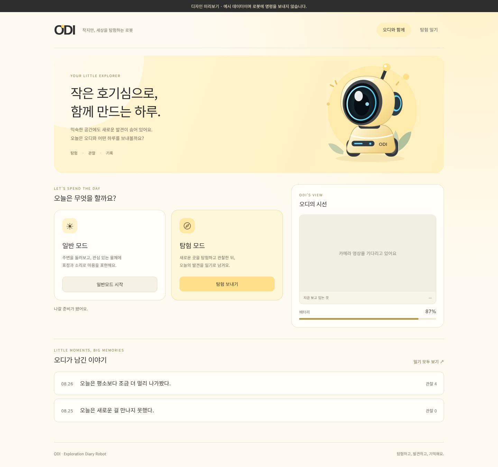

# ODI 웹 디자인 미리보기

발표 시안의 연노랑 `#FFE08A`, 크림 `#FFF7D6`, 차콜 `#2E2E2E`, 하늘색 `#6ED9FF`를 적용한 웹 테마입니다.
홈의 모드 선택, 탐험 중 카메라·지도·발견 기록, 일반모드 상태, 탐험 일기를 같은 분위기로 구성했습니다.
사용자가 제공한 일러스트 4장을 `static/media/illustrations/`에서 불러옵니다. 원본 해상도를 유지한 WebP 형식이며 홈·탐험·회고·일기 목록에 각각 적용했습니다.

## 로봇 없이 보기

```bash
cd web_ws
python3 -m venv .venv-preview
source .venv-preview/bin/activate
python -m pip install 'flask>=3.0' 'flask-sock>=0.7' pillow numpy
python preview.py
```

브라우저에서 **http://127.0.0.1:8001** 을 엽니다. HTTPS 주소가 아닙니다.

- 홈: http://127.0.0.1:8001/
- 탐험: http://127.0.0.1:8001/?screen=EXPLORING
- 일반모드: http://127.0.0.1:8001/?screen=NORMAL
- 일기 목록: http://127.0.0.1:8001/diary
- 회고: http://127.0.0.1:8001/?screen=REFLECTING
- 준비 중: http://127.0.0.1:8001/?screen=PREPARING
- 오류 안내: http://127.0.0.1:8001/?screen=ERROR

미리보기는 예시 상태와 기존 샘플 일기를 사용합니다. 사이드 메뉴와 시작 버튼으로 탐험·일반 모드 예시 화면을 열 수 있고 종료 버튼은 홈으로 이동합니다. 일반 모드의 카메라와 반응 상태는 명시적으로 표시한 예시입니다. 화면 상단에 미리보기 표시가 나오며, 시작·종료 등 쓰기 요청은 차단합니다. ROS 노드를 실행하거나 실제 DB를 읽지 않습니다. 카메라와 지도는 연결 대기 상태로 보입니다. 샘플 사진 파일이 없는 경우에는 사진이 표시되지 않습니다.

실제 로봇을 사용할 때는 기존 실행 명령을 그대로 사용합니다. `run.py`, ROS 제어, API 경로, 미션 상태 전환 로직은 변경하지 않았습니다.

## 디자인 수정 위치

- `static/css/companion.css`: 공통 색상, 반응형 배치, 버튼·카드·일기 스타일
- `static/index.html`, `static/diary.html`: 공통 로고와 내비게이션
- `static/js/exploring.js`의 `renderIdle()`: 홈 화면 구조
- `static/css/illustrations.css`: 페이지별 일러스트 배치와 모바일 레이아웃
- `static/media/illustrations/odi-home.webp`: 오디_홈 → 홈
- `static/media/illustrations/odi-observation.webp`: 오디_관찰 → 탐험
- `static/media/illustrations/odi-reflection.webp`: 오디_노을 → 회고 및 일기 생성 중
- `static/media/illustrations/odi-memories.webp`: 오디_기억 → 일기 목록

`.gitignore`는 일러스트 폴더만 추적하도록 예외를 두고, 로봇 촬영 파일은 기존처럼 제외합니다.

카메라 DOM의 지속 연결과 지도 오버레이 좌표 처리는 유지합니다. 사진은 잘리지 않도록 원본 비율로 표시합니다.

## 홈 화면 예시



데스크톱 1440px와 모바일 390px에서 배치, 상태 화면 전환, 일기 목록·상세 표시 및 미리보기 명령 차단을 확인했습니다. 실제 로봇 연결 테스트는 별도로 진행해야 합니다.


## 화면 배치 보완

홈 왼쪽 카드들은 독립된 세로 열로 배치해 오른쪽 상태 카드 높이에 따른 공백을 제거했습니다. 데스크톱(981px 이상) 탐험 화면은 카메라·지도·발견 기록을 3열로 표시하고 높이를 창에 맞춥니다. 발견이 많으면 해당 카드 내부에서 스크롤합니다. 작은 화면은 2열 또는 1열로 전환합니다.

페이지 응답, JS 문법, 일반 모드의 카메라 연결 유지, 프리뷰 예시 표시와 쓰기 요청 차단을 확인했습니다. 이번 배치 변경의 브라우저 캡처 검증은 실행 환경 제약으로 수행하지 못했습니다.
