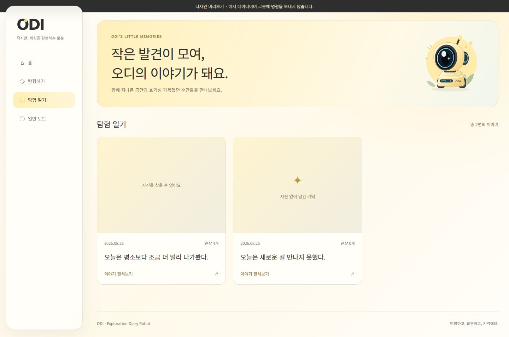

# 탐험 일기 대시보드

홈의 사이드바, 배경, 여백 규칙을 일기 목록과 상세 페이지에 적용했습니다.
목록에는 대표 사진, 전체 날짜, 관찰 개수, 일기 첫 문장이 표시됩니다.
상세는 사진과 글을 세로로 읽는 구성을 유지하며 원본 사진 비율을 보존합니다.

`/api/sessions` 응답에 `date_full`, `photo_url`을 추가했습니다. 기존 필드는 유지합니다.
대표 사진은 해당 미션에 저장된 비어 있지 않은 관찰 사진 경로 하나를 사용합니다.
조회는 기존 목록 쿼리 하나로 처리하며, 일기마다 별도 상세 요청을 하지 않습니다.
사진이 없거나 파일이 사라진 경우에는 안내 문구가 표시됩니다.

일기장 사이드바의 탐험·일반 모드 링크는 홈의 시작 버튼으로 이동합니다.
페이지를 이동하는 것만으로 로봇에 시작 명령을 보내지 않습니다.

## 확인

- SQLite 테스트 데이터로 목록 조회와 빈 일기·사진 경로·관찰 개수 응답 검사
- 브라우저에서 목록 → 상세, 사진 누락, 빈 목록, 서버 오류 확인
- 데스크톱 1440px / 모바일 390px에서 가로 넘침 없음, JavaScript 예외 없음
- 실제 MySQL 데이터와 로봇 연결 검사는 별도 필요

```bash
python3 -m unittest discover -s web_ws/tests -p test_diary_listing.py
```

로봇 없는 미리보기는 `web_ws`에서 `python3 preview.py`를 실행한 뒤
http://127.0.0.1:8001/diary 에서 확인할 수 있습니다.


